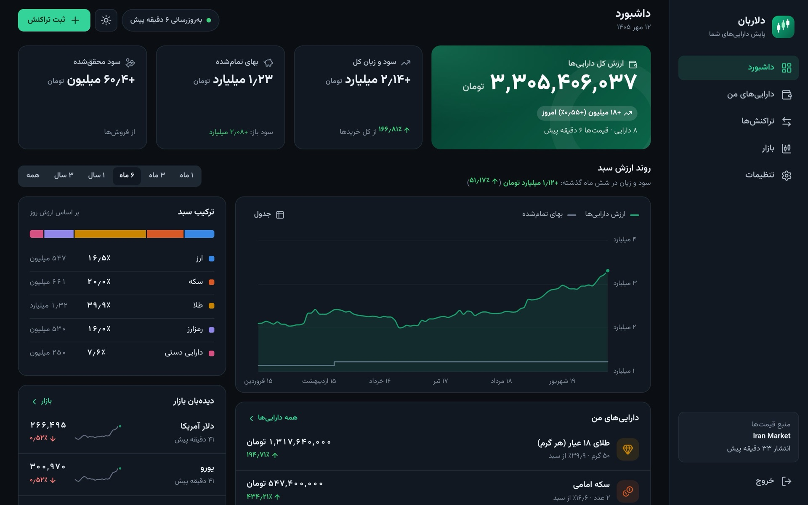
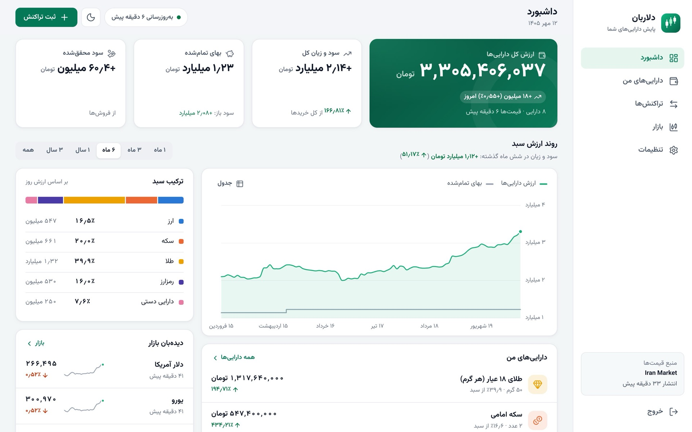
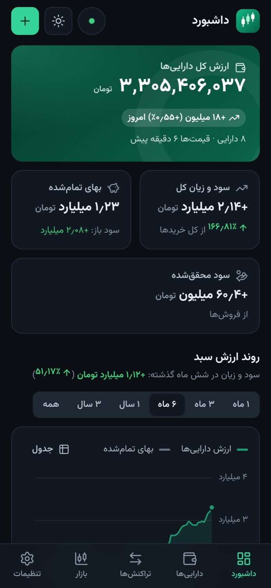
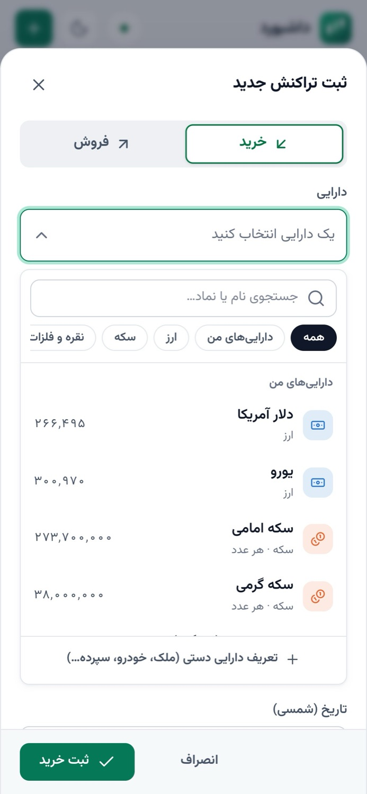
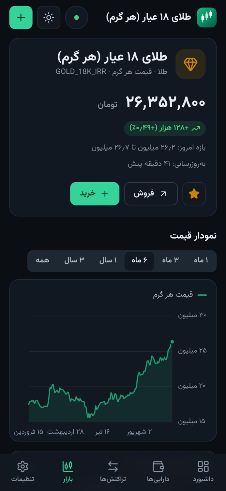

# دلاربان | داشبورد شخصی پایش دارایی‌ها

<p align="center">
  <a href="https://github.com/MahdiGraph/DollarBaan/releases/latest"></a>
  
  
  
  
  
</p>

<p align="center">
  
</p>

<p align="center">
  <a href="https://github.com/MahdiGraph/DollarBaan/releases/latest"><b>دانلود برنامه</b></a> ·
  <a href="#-نصب-روی-سرور">نصب روی سرور</a> ·
  <a href="#-رفع-اشکال">رفع اشکال</a> ·
  <a href="CHANGELOG.md">تغییرات نسخه‌ها</a> ·
  <a href="#english-summary">English</a>
</p>

## 📋 معرفی

**دلاربان** (DollarBaan) یک داشبورد مالی شخصی و متن‌باز است. خرید و فروش ارز، طلا، سکه، رمزارز و حتی دارایی‌هایی مثل سپرده بانکی، ملک یا خودرو را ثبت می‌کنید و دلاربان ارزش لحظه‌ای سبد، میانگین قیمت خرید، سود و زیان و روند دارایی‌هایتان را به **تومان** نشان می‌دهد.

دلاربان را می‌توانید به‌صورت **برنامه ویندوز، مک، لینوکس و اندروید** نصب کنید (بدون سرور و ثبت‌نام؛ داده‌ها فقط روی دستگاه خودتان) یا روی **سرور شخصی** راه بیندازید تا از همه دستگاه‌ها با رمز عبور به آن دسترسی داشته باشید.

قیمت‌ها به‌طور پیش‌فرض از [Iran Market Data](https://github.com/iran-market/iran-market.github.io) دریافت می‌شوند؛ یعنی **رایگان، بدون ثبت‌نام و بدون نیاز به کلید API**. در نسخه سرور می‌توانید از صفحه تنظیمات منبع را به نوسان تغییر دهید.

## 📥 دانلود

آخرین نسخه را از صفحه **[Releases](https://github.com/MahdiGraph/DollarBaan/releases/latest)** دانلود کنید:

| سیستم‌عامل | فایل |
|---|---|
| ویندوز ۱۰ و ۱۱ | `DollarBaan-…-windows-setup.exe` (نصبی) یا `…-windows-portable.exe` (بدون نصب) |
| مک با تراشه اپل (M1 و جدیدتر) | `DollarBaan-…-mac-arm64.dmg` |
| مک اینتل | `DollarBaan-…-mac-x64.dmg` |
| لینوکس | `…-linux-amd64.deb` برای اوبونتو و دبیان، `…-linux-x86_64.AppImage` برای سایر توزیع‌ها |
| اندروید ۷ و جدیدتر | `DollarBaan-…-android.apk` |

- برنامه‌ها به سرور نیاز ندارند: داده‌ها فقط روی همان دستگاه ذخیره می‌شوند و برنامه جز دریافت فایل‌های عمومی قیمت از GitHub یا jsDelivr به هیچ جایی وصل نمی‌شود.
- برای انتقال داده بین دستگاه‌ها (یا بین برنامه و نسخه سرور) از **تنظیمات › پشتیبان‌گیری** فایل پشتیبان بگیرید و در مقصد بازیابی کنید.
- برنامه‌ها امضای تجاری ندارند؛ اگر بار اول هشدار دیدید، راهنمای [اولین اجرا](#-رفع-اشکال) را ببینید.

## ✨ نسخه ۲ چه چیزهایی دارد؟

- **برنامه دسکتاپ و اندروید (۲.۱):** همان دلاربان به‌صورت برنامه مستقل برای ویندوز، مک، لینوکس و اندروید، کاملاً آفلاین از نظر داده: بدون سرور، بدون حساب کاربری و با ذخیره همه چیز روی دستگاه.
- **منبع داده رایگان و پایدار:** Iran Market با بیش از ۲۴۰ دارایی (ارزها، طلا، سکه، صندوق‌های طلا، نقره و رمزارزها) که هر ۳۰ دقیقه به‌روز می‌شود، همراه با تاریخچه روزانه چندساله. اگر GitHub در دسترس نباشد، خودکار از jsDelivr یا آینه اختصاصی شما استفاده می‌شود.
- **ثبت خرید و فروش واقعی:** مقدار و قیمت واقعی معامله را وارد می‌کنید (یا مبلغ کل را، تا مقدار حساب شود). قیمت بازارِ همان تاریخ خودکار پیشنهاد می‌شود. فروش‌ها، کارمزد، **میانگین قیمت خرید**، **سود محقق‌شده** و **سود باز** محاسبه می‌شوند و فروش بیش از موجودی پذیرفته نمی‌شود.
- **دارایی دستی:** برای دارایی‌هایی که قیمت آنلاین ندارند (سپرده، ملک، خودرو، سهام و…) قیمت را خودتان ثبت و هر وقت خواستید به‌روز کنید.
- **داشبورد جدید:** ارزش کل و تغییر امروز، سود و زیان، نمودار روند ارزش سبد در مقابل بهای تمام‌شده، ترکیب سبد بر اساس دسته، دیده‌بان بازار با نمودار کوچک، آخرین تراکنش‌ها و نمایش جدولی داده‌های نمودار.
- **صفحه هر دارایی:** نمودار قیمت با نقاط خرید و فروش شما، وضعیت موقعیت و تراکنش‌های همان دارایی.
- **بازار:** جستجو در همه قیمت‌ها با پشتیبانی از ارقام فارسی، فیلتر دسته‌ها و افزودن به دیده‌بان.
- **رابط کاربری بازطراحی‌شده:** راست‌به‌چپ، فونت وزیرمتن، تقویم شمسی اختصاصی، حالت روشن و تیره، طراحی کامل برای موبایل و قابل افزودن به صفحه اصلی گوشی. **هیچ فایلی از CDN بارگذاری نمی‌شود** و برنامه بدون دسترسی به CDNهای خارجی کار می‌کند.
- **پشتیبان‌گیری:** خروجی کامل JSON برای بازگردانی و خروجی Excel (CSV) از تراکنش‌ها.
- **امنیت بهتر:** رمز قابل‌تغییر از تنظیمات (ذخیره با scrypt)، نشست‌های امن در دیتابیس، محدودیت تلاش ورود، محافظت CSRF و هدرهای امنیتی.
- **انتقال خودکار از نسخه ۱:** داده‌های قبلی بدون از دست رفتن مبلغ سرمایه‌گذاری‌ها منتقل می‌شوند (جزئیات در بخش ارتقا).
- **نصب ساده:** اجرا با Node.js، با PM2، یا با یک دستور Docker. SQLite پیش‌فرض است و MySQL/MariaDB هم پشتیبانی می‌شود.

<p align="center">
  
</p>

<p align="center">
  
  
  
</p>

## 🔌 منبع داده‌ها

| منبع | هزینه | کلید API | به‌روزرسانی | پوشش |
|---|---|---|---|---|
| **Iran Market** (پیش‌فرض) | رایگان | لازم نیست | هر ۳۰ دقیقه، تاریخچه روزانه | ارز، طلا، سکه، صندوق طلا، فلزات، رمزارز |
| نوسان | پلن رایگان ۱۲۰ درخواست در ماه | لازم است | به انتخاب شما | ارز، طلا، سکه، تتر |

- قیمت دارایی‌های دلاری (مثل انس طلا یا رمزارزهایی که قیمت تومانی ندارند) با نرخ تتر یا دلار آزاد به تومان تبدیل می‌شود.
- از صفحه **تنظیمات › منبع قیمت‌ها** می‌توانید منبع، آدرس دریافت داده (GitHub، jsDelivr یا آینه شخصی) و بازه به‌روزرسانی را تغییر دهید و اتصال را آزمایش کنید.
- اگر از نوسان استفاده می‌کنید، به‌خاطر سقف درخواست‌های پلن رایگان، بازه به‌روزرسانی را ۱۲ یا ۲۴ ساعت بگذارید.

## 💻 نصب روی سرور

اگر فقط روی یک دستگاه از دلاربان استفاده می‌کنید، [برنامه آماده](#-دانلود) ساده‌ترین راه است. نسخه سرور برای وقتی است که می‌خواهید از چند دستگاه (کامپیوتر، گوشی، مرورگر) به یک سبد مشترک با رمز عبور دسترسی داشته باشید.

### روش ۱: Node.js

پیش‌نیاز: **Node.js نسخه ۲۰.۱۹ یا بالاتر** (پیشنهاد: ۲۲ LTS).

```bash
git clone https://github.com/MahdiGraph/DollarBaan.git
cd DollarBaan
npm install
cp .env.template .env   # رمز عبور را در این فایل عوض کنید
npm start
```

حالا برنامه روی `http://localhost:3000` در دسترس است. نام کاربری و رمز پیش‌فرض `admin` و `changeit` است؛ حتماً آن را در `.env` یا از **تنظیمات › امنیت** تغییر دهید.

### روش ۲: Docker

```bash
git clone https://github.com/MahdiGraph/DollarBaan.git
cd DollarBaan
cp .env.template .env   # اختیاری؛ برای تغییر نام کاربری و رمز
docker compose up -d --build
```

داده‌ها در volume با نام `dollarbaan-data` نگه‌داری می‌شوند و با به‌روزرسانی کانتینر از بین نمی‌روند.

### اجرای دائمی با PM2

```bash
npm install -g pm2
pm2 start ecosystem.config.js
pm2 save && pm2 startup
```

دستورهای مفید: `pm2 status`، `pm2 logs DollarBaan` و `pm2 restart DollarBaan`.

## ⚙️ تنظیمات `.env`

| متغیر | پیش‌فرض | توضیح |
|---|---|---|
| `AUTH_USERNAME` / `AUTH_PASSWORD` | `admin` / `changeit` | اطلاعات ورود. بعد از تغییر رمز از تنظیمات، رمز ذخیره‌شده در دیتابیس ملاک است. |
| `PORT` | `3000` | پورت برنامه |
| `TRUST_PROXY` | `false` | اگر پشت nginx، Caddy یا Cloudflare هستید `true` کنید. |
| `COOKIE_SECURE` | `auto` | کوکی امن فقط روی HTTPS؛ `true` یا `false` برای اجبار |
| `SESSION_MAX_AGE` | ۷ روز | مدت اعتبار نشست ورود (میلی‌ثانیه) |
| `DB_DIALECT` | `sqlite` | `sqlite` یا `mysql` |
| `SQLITE_PATH` | `./database.sqlite` | مسیر فایل دیتابیس SQLite |
| `DB_NAME`، `DB_USER`، `DB_PASSWORD`، `DB_HOST`، `DB_PORT` | | تنظیمات MySQL/MariaDB |
| `PRICE_PROVIDER` | `iran-market` | منبع اولیه قیمت (`iran-market` یا `navasan`) |
| `IRAN_MARKET_MIRROR` | `github` | `github`، `jsdelivr` یا `custom` |
| `IRAN_MARKET_BASE_URL` | | آدرس آینه اختصاصی پوشه `data` |
| `NAVASAN_API_KEY` | | کلید نوسان (فقط برای منبع نوسان) |
| `REFRESH_INTERVAL_MINUTES` | `30` | بازه اولیه به‌روزرسانی قیمت‌ها |
| `LOG_LEVEL` / `LOG_DIR` | `info` / `./logs` | سطح و پوشه لاگ؛ `LOG_DIR=off` یعنی فقط خروجی کنسول |

منبع قیمت، بازه به‌روزرسانی، واحد نمایش (تومان یا ریال)، بازه نمودار و دیده‌بان از داخل برنامه تنظیم می‌شوند و مقادیر بالا فقط مقدار اولیه‌اند.

## 🔄 ارتقا از نسخه ۱

```bash
# قبل از هر کاری از فایل دیتابیس نسخه پشتیبان بگیرید
cp database.sqlite database.backup.sqlite

git pull
npm install
pm2 restart DollarBaan   # یا npm start
```

- فایل `.env` قبلی شما بدون تغییر کار می‌کند. `API_KEY` قدیمی، اگر تنظیم شده باشد، به‌عنوان کلید نوسان استفاده می‌شود، اما منبع پیش‌فرض Iran Market است.
- در اولین اجرا، پس از دریافت قیمت‌ها، سرمایه‌گذاری‌های نسخه ۱ خودکار به تراکنش خرید تبدیل می‌شوند. **مبلغ هر سرمایه‌گذاری دقیقاً حفظ می‌شود** و مقدار خریداری‌شده از قیمت بازار در همان تاریخ محاسبه می‌شود.
- اقلامی که در Iran Market معادل ندارند (مثل حواله‌ها) به «دارایی دستی» با آخرین قیمت و تاریخچه قبلی‌شان تبدیل می‌شوند.
- جدول‌های نسخه ۱ دست نمی‌خورند و انتقال فقط یک بار انجام می‌شود.

## 🖥️ راهنمای استفاده

1. با دکمه **ثبت تراکنش** خرید یا فروش ثبت کنید: دارایی را جستجو کنید، تاریخ شمسی را انتخاب کنید و مقدار یا مبلغ کل را وارد کنید. قیمت بازارِ آن روز خودکار پر می‌شود و قابل ویرایش است.
2. برای سپرده بانکی یا پول نقد، یک **دارایی دستی** با واحد «تومان» و قیمت ۱ بسازید تا مقدار همان مبلغ باشد.
3. در صفحه **بازار** دارایی‌های دلخواه را ستاره بزنید تا در **دیده‌بان** داشبورد نمایش داده شوند.
4. از **تنظیمات › پشتیبان‌گیری** فایل پشتیبان دانلود کنید. همان فایل را می‌توانید روی نصب دیگری بازگردانی کنید.

## 🔒 نکات امنیتی

- رمز پیش‌فرض را حتماً عوض کنید. تا وقتی عوض نشود، برنامه هشدار نمایش می‌دهد.
- برای دسترسی از اینترنت، برنامه را پشت HTTPS قرار دهید و `TRUST_PROXY=true` کنید. نمونه تنظیم nginx:

```nginx
server {
    server_name dollar.example.com;
    location / {
        proxy_pass http://127.0.0.1:3000;
        proxy_set_header Host $host;
        proxy_set_header X-Forwarded-For $proxy_add_x_forwarded_for;
        proxy_set_header X-Forwarded-Proto $scheme;
    }
}
```

## 🛠️ توسعه

```bash
npm run dev   # اجرای سرور با راه‌اندازی مجدد خودکار
npm test      # اجرای تست‌ها
```

ساختار پروژه:

```
public/                  رابط کاربری (JavaScript ماژولار بدون فریم‌ورک و بدون build)
  assets/js/shared/      منطق مشترک سرور و برنامه‌ها: دفتر تراکنش، منابع قیمت، همگام‌سازی و API
  assets/js/local/       بک‌اند داخلی برنامه‌ها روی IndexedDB
server/                  سرور (Express 5 و Sequelize) روی همان منطق مشترک
desktop/                 برنامه دسکتاپ (Electron)
mobile/                  برنامه اندروید (Capacitor)
scripts/                 ساخت آیکون‌ها، همگام‌سازی نسخه، تست اجرای برنامه‌ها، کلید امضای اندروید
test/                    تست‌ها (node:test)
```

رابط کاربری دو حالت دارد: در نسخه سرور درخواست‌ها به API سرور می‌رود و در برنامه‌ها (و هر میزبانی ساده فایل‌های `public/`) همان API داخل خود برنامه اجرا می‌شود.

### ساخت برنامه‌ها

```bash
# دسکتاپ: اجرا در حالت توسعه، و ساخت فایل نصب برای سیستم‌عامل فعلی در desktop/dist
cd desktop && npm install
npm start
npm run dist

# اندروید: نیاز به JDK 21 و Android SDK
cd mobile && npm install
npx cap sync android
npx cap open android   # باز کردن در Android Studio؛ یا: npm run apk
```

### انتشار نسخه جدید

با هر تگ نسخه، GitHub Actions همه برنامه‌ها را می‌سازد، روی ویندوز، مک، لینوکس و شبیه‌ساز اندروید اجرا و آزمایش می‌کند و در Releases منتشر می‌کند:

```bash
# نسخه را در package.json تغییر دهید و تغییرات را در CHANGELOG.md بنویسید، سپس:
npm run version:sync
git commit -am "Release 2.1.1" && git tag v2.1.1 && git push && git push --tags
```

فایل APK فقط وقتی منتشر می‌شود که کلید امضای اندروید یک بار ساخته شده باشد: `bash scripts/android-signing.sh` (کلید بیرون از مخزن ساخته و در Secrets مخزن ذخیره می‌شود؛ از پوشه آن نسخه پشتیبان نگه دارید، چون به‌روزرسانی APK فقط با همین کلید ممکن است). اگر ریلیزی بدون APK منتشر شده، بعد از ساخت کلید workflow را برای همان تگ دوباره اجرا کنید: `gh workflow run release.yml --ref v2.1.0`

آیکون‌ها از `public/assets/img/logo.svg` ساخته می‌شوند: `npm install --no-save sharp && node scripts/build-app-icons.js`

## 🔧 رفع اشکال

- **ویندوز پیام «Windows protected your PC» نشان می‌دهد:** روی «More info» و سپس «Run anyway» بزنید. این پیام به‌خاطر نداشتن گواهی امضای تجاری است.
- **مک برنامه را باز نمی‌کند:** به System Settings › Privacy & Security بروید و «Open Anyway» را بزنید، یا در ترمینال اجرا کنید: `xattr -dr com.apple.quarantine /Applications/DollarBaan.app`
- **AppImage روی اوبونتو ۲۴.۰۴ اجرا نمی‌شود:** فایل deb را نصب کنید (پروفایل AppArmor لازم را خودش نصب می‌کند)، یا AppImage را با `--no-sandbox` اجرا کنید.
- **اندروید اجازه نصب نمی‌دهد:** در تنظیمات گوشی اجازه «نصب برنامه‌های ناشناس» را به مرورگر یا مدیر فایل بدهید. نسخه‌های بعدی روی همین نصب به‌روز می‌شوند و داده‌ها حفظ می‌شود.
- **قیمت‌ها دریافت نمی‌شوند:** در تنظیمات دکمه «آزمایش اتصال» را بزنید. اگر GitHub روی سرورتان در دسترس نیست، آدرس دریافت داده را jsDelivr یا یک آینه شخصی بگذارید.
- **خطای sqlite3 یا `require` هنگام اجرای سرور:** نسخه Node.js را بررسی کنید (۲۰.۱۹ یا بالاتر) و `npm install` را دوباره اجرا کنید.
- **جزئیات بیشتر:** `LOG_LEVEL=debug` را تنظیم کنید و فایل‌های پوشه `logs` یا خروجی `pm2 logs` را ببینید.

## 🙏 قدردانی

- [Iran Market Data](https://github.com/iran-market/iran-market.github.io) برای داده رایگان بازار (منبع اولیه: TGJU)
- [نوسان](https://navasan.tech) برای وب‌سرویس قیمت
- [صابر راستی‌کردار](https://github.com/rastikerdar) برای فونت [وزیرمتن](https://github.com/rastikerdar/vazirmatn)
- [Chart.js](https://www.chartjs.org) و [Lucide](https://lucide.dev)

قیمت‌ها صرفاً برای اطلاع‌رسانی هستند و توصیه خرید یا فروش محسوب نمی‌شوند.

## 📄 مجوز

این پروژه تحت مجوز MIT منتشر شده است؛ جزئیات در فایل [LICENCE.md](LICENCE.md).

## 🤝 مشارکت

پیشنهادها و گزارش‌های خطا را در [Issues](https://github.com/MahdiGraph/DollarBaan/issues) ثبت کنید. Pull Requestها هم با کمال میل پذیرفته می‌شوند.

---

## English summary

**DollarBaan (دلاربان)** is an open-source personal finance dashboard and portfolio tracker for Iranian users. Record buys and sells of currencies (US dollar, euro and more), gold, gold coins (Emami, Bahar Azadi), crypto (Bitcoin, Tether) and manually priced assets (bank deposits, property, cars) and track portfolio value, average cost, realized and unrealized profit, and history, all in Iranian Toman.

- **Apps for Windows, macOS, Linux and Android** on the [Releases](https://github.com/MahdiGraph/DollarBaan/releases/latest) page: no server or account needed, data stays on the device, prices are fetched straight from the public Iran Market files. Or self-host it to share one portfolio across devices.
- **Free market data by default** from [Iran Market Data](https://github.com/iran-market/iran-market.github.io): no sign-up and no API key, 240+ assets refreshed every 30 minutes, multi-year daily history, and automatic fallback from GitHub to jsDelivr or a custom mirror. Navasan remains available as an optional provider.
- Buy and sell ledger with average-cost accounting, oversell protection, market price suggestions for any past date, and custom assets.
- Redesigned RTL interface: Vazirmatn font, Jalali date picker, light and dark themes, mobile layout with add-to-home-screen support, and no external CDN dependencies.
- JSON backup and restore, CSV export, scrypt password hashing, database-backed sessions, login rate limiting and CSRF protection.
- Automatic migration of DollarBaan 1.x data that keeps every invested amount.
- The server runs with Node.js 20.19+, PM2 or Docker Compose, on SQLite (default) or MySQL/MariaDB. The desktop (Electron) and Android (Capacitor) apps run the same shared core on IndexedDB; every tagged version is built, smoke-tested and published by GitHub Actions.

```bash
git clone https://github.com/MahdiGraph/DollarBaan.git && cd DollarBaan
npm install && cp .env.template .env && npm start   # http://localhost:3000
```

---

<p align="center">
  <strong>دلاربان</strong> | پایش دارایی‌های شما، ساده و شخصی
</p>
