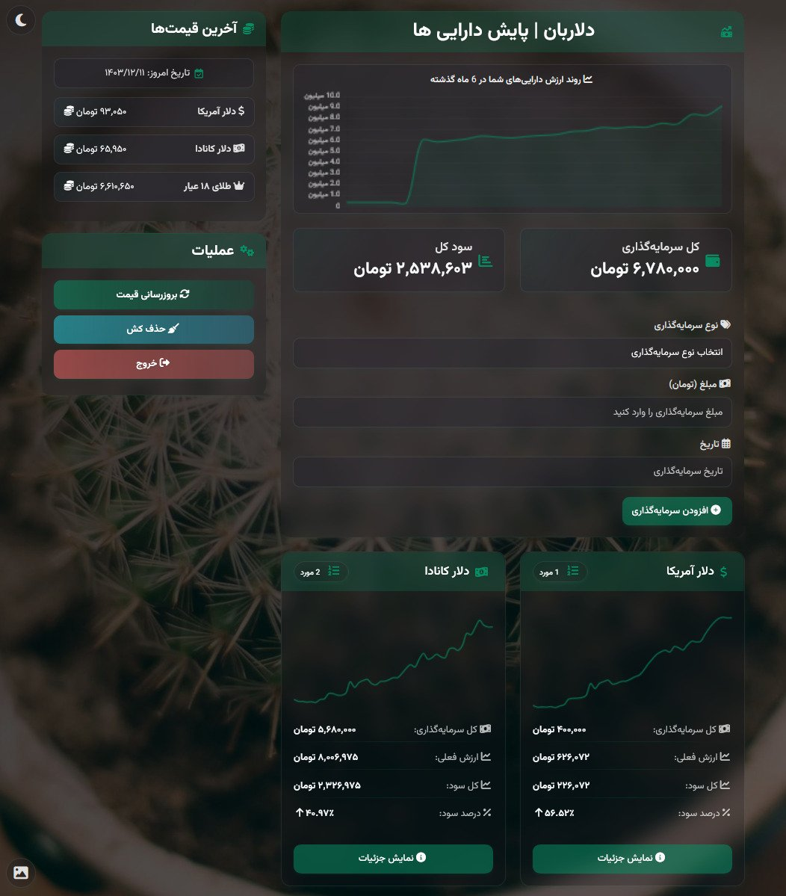

# دلاربان | سیستم پایش ارزش دارایی‌های فیزیکی

<p align="center">
  
  
  
  
</p>

<p align="center">
  
</p>

## 📋 معرفی 

**دلاربان** یک سیستم پایش و مدیریت ارزش دارایی‌های فیزیکی است که به شما امکان می‌دهد سرمایه‌گذاری‌های خود در انواع دارایی‌ها (دلار، یورو، طلا، سکه، رمزارزها و...) را ثبت و ارزش آن‌ها را به صورت لحظه‌ای رصد کنید.

این پروژه به صورت **کاملاً متن‌باز** تحت لایسنس MIT منتشر شده و استفاده، توسعه و انتشار مجدد آن برای همه آزاد است.

<p align="center">
  
</p>

با دلاربان می‌توانید:
- سرمایه‌گذاری‌های خود را در انواع دارایی‌ها ثبت کنید
- از نمودارهای تحلیلی برای بررسی روند ارزش دارایی‌ها استفاده کنید (نمودارها بیشتر برای مشاهده روند کلی هستند)
- سود و زیان سرمایه‌گذاری‌های خود را مشاهده کنید
- به صورت خودکار از به‌روزترین قیمت‌ها بهره‌مند شوید

## ✨ ویژگی‌های اصلی

- **رابط کاربری زیبا و شیشه‌ای**: طراحی Glass Morphism با قابلیت تغییر رنگ و تم
- **بروزرسانی خودکار قیمت‌ها**: دریافت قیمت‌های به‌روز از API نوسان
- **نمودارهای تحلیلی**: نمایش روند تغییرات قیمت و ارزش پورتفولیو
- **تقویم شمسی**: کار با تاریخ‌های هجری شمسی
- **پاسخگو**: قابل استفاده در دسکتاپ و موبایل
- **کش‌گذاری هوشمند**: افزایش سرعت بارگذاری و کاهش مصرف API

## 🔧 پیش‌نیازها

- **Node.js**: نسخه 16.x یا بالاتر
- **MySQL/MariaDB**: نسخه 5.7 یا بالاتر
- **API Key سرویس Navasan**: برای دریافت از [Navasan.tech](https://navasan.tech) ثبت‌نام کنید (دارای پلن رایگان)

## 💻 نصب و راه‌اندازی 

### دانلود و نصب وابستگی‌ها

```bash
# کلون کردن مخزن
git clone https://github.com/yourusername/dollarbaan.git
cd dollarbaan

# نصب وابستگی‌ها
npm install
```

### تنظیم فایل .env

فایل `.env.template` را به `.env` تغییر نام دهید و اطلاعات مورد نیاز را در آن وارد کنید:

```bash
# کپی فایل نمونه
cp .env.template .env

# ویرایش فایل با ویرایشگر دلخواه
nano .env  # یا هر ویرایشگر دیگری
```

مقادیر زیر را در فایل `.env` تنظیم کنید:

```
# ===============================================
# تنظیمات پایگاه داده MySQL
# ===============================================
DB_NAME=dollarbaan              # نام پایگاه داده
DB_USER=root                    # نام کاربری
DB_PASSWORD=                    # رمز عبور
DB_HOST=localhost               # آدرس میزبان
DB_PORT=3306                    # پورت
DB_DIALECT=mysql                # نوع پایگاه داده

# ===============================================
# تنظیمات احراز هویت
# ===============================================
AUTH_USERNAME=admin             # نام کاربری برای ورود به سیستم
AUTH_PASSWORD=changeit          # رمز عبور (حتما تغییر دهید)
SESSION_SECRET=your_secret_key  # کلید رمزنگاری نشست (حتما تغییر دهید)
SESSION_MAX_AGE=86400000        # مدت اعتبار نشست (24 ساعت)

# ===============================================
# تنظیمات API نوسان
# ===============================================
API_KEY=your_api_key            # کلید API نوسان (دریافت از navasan.tech)

# دیگر تنظیمات مطابق با فایل نمونه
```

### آماده‌سازی پایگاه داده

در MySQL یک پایگاه داده با نام `dollarbaan` ایجاد کنید:

```sql
CREATE DATABASE dollarbaan CHARACTER SET utf8mb4 COLLATE utf8mb4_unicode_ci;
```

### اجرای برنامه

#### محیط Development

```bash
# اجرای مستقیم با Node.js
node app.js
```

#### محیط Production

```bash
# نصب PM2 در صورت نیاز
npm install -g pm2

# اجرای برنامه با PM2
npm start
# یا مستقیم
pm2 start ecosystem.config.js
```

پس از اجرا، برنامه روی پورت تعیین شده (پیش‌فرض: 3000) در دسترس خواهد بود:

```
http://localhost:3000
```

## 🚀 مدیریت با PM2

دستورات اصلی PM2 برای مدیریت برنامه:

```bash
# مشاهده وضعیت برنامه‌ها
pm2 status

# راه‌اندازی مجدد برنامه
pm2 restart DollarBaan

# توقف برنامه
pm2 stop DollarBaan

# حذف برنامه از لیست PM2
pm2 delete DollarBaan
```

## 🔑 اهمیت API Key نوسان

**توجه مهم**: این برنامه از API سرویس [Navasan.tech](https://navasan.tech) برای دریافت قیمت‌های لحظه‌ای استفاده می‌کند. برای استفاده از دلاربان لازم است:

1. در سایت navasan.tech ثبت‌نام کنید
2. یک API Key دریافت کنید (پلن رایگان کافی است)
3. کلید را در فایل `.env` در بخش `API_KEY` قرار دهید

بدون API Key معتبر، امکان دریافت قیمت‌های به‌روز وجود نخواهد داشت.

## 📁 ساختار پروژه

```
dollarbaan/
├── app.js                 # فایل اصلی اپلیکیشن
├── ecosystem.config.js    # تنظیمات PM2
├── package.json           # وابستگی‌های پروژه
├── .env.template          # نمونه فایل تنظیمات محیطی
├── .env                   # فایل تنظیمات محیطی (باید ایجاد شود)
├── .gitignore             # فایل‌های نادیده گرفته شده توسط git
├── LICENSE                # فایل مجوز MIT
├── logs/                  # پوشه لاگ‌ها
│   └── .gitkeep           # برای حفظ پوشه خالی در git
├── sessions/              # پوشه ذخیره نشست‌ها
│   └── .gitkeep           # برای حفظ پوشه خالی در git
└── public/                # فایل‌های استاتیک و فرانت‌اند
    ├── index.html         # صفحه اصلی
    ├── login.html         # صفحه ورود
    └── assets/            # استایل‌ها و فونت‌ها
        ├── style.css      # استایل‌های اصلی
        ├── img/           # تصاویر
        └── fonts/         # فونت‌ها
```

## 🖥️ نحوه استفاده

1. به آدرس `http://localhost:3000` (یا هر پورت تنظیم شده) بروید
2. با نام کاربری و رمز عبور تعیین شده در فایل `.env` وارد شوید
3. از منوی اصلی می‌توانید:
   - سرمایه‌گذاری جدید اضافه کنید
   - آخرین قیمت‌ها را مشاهده کنید
   - گزارش‌های تحلیلی را بررسی کنید
   - قیمت‌ها را به‌روزرسانی کنید

## 🔧 فناوری‌های استفاده شده

- **بک‌اند**: Node.js، Express، Sequelize
- **پایگاه داده**: MySQL/MariaDB
- **فرانت‌اند**: JavaScript، Chart.js، Bootstrap
- **UI/UX**: Glass Morphism، CSS3، HTML5
- **تاریخ شمسی**: moment-jalaali
- **زمان‌بندی**: node-cron
- **مدیریت پروسه**: PM2
- **فونت**: [وزیرمتن](https://github.com/rastikerdar/vazirmatn)

## 🔄 رفع اشکال

در صورت بروز مشکل، موارد زیر را بررسی کنید:

- اطمینان از صحت اطلاعات پایگاه داده در فایل `.env`
- معتبر بودن API Key نوسان
- دسترسی‌های پوشه‌های `logs` و `sessions`
- اطمینان از نصب تمامی وابستگی‌ها

## 🙏 قدردانی

- با تشکر از [Navasan.tech](https://navasan.tech) برای ارائه API قیمت‌های لحظه‌ای
- با تشکر ویژه از [Saber Rastikerdar](https://github.com/rastikerdar) و تیم توسعه‌دهنده [Vazirmatn](https://github.com/rastikerdar/vazirmatn) برای توسعه این فونت زیبا و متن‌باز فارسی که در این پروژه استفاده شده است

## 📄 مجوز استفاده

این پروژه تحت مجوز MIT منتشر شده است. برای اطلاعات بیشتر به فایل LICENSE مراجعه کنید.

## 🤝 مشارکت

از مشارکت شما در توسعه این پروژه استقبال می‌کنیم! لطفاً برای هرگونه پیشنهاد یا گزارش مشکل، یک issue جدید ایجاد کنید یا pull request بفرستید.

---

<p align="center">
  <strong>دلاربان</strong> | پایش لحظه‌ای دارایی فیزیکی شما
</p>